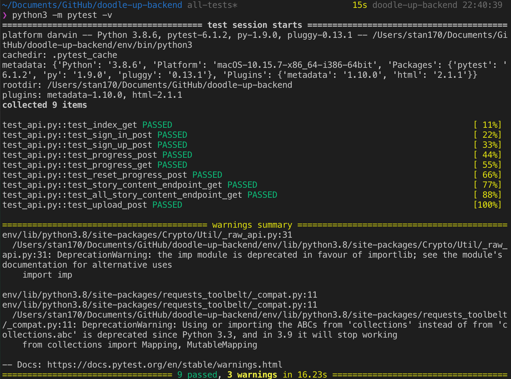

# DoodleUp Backend [](https://travis-ci.com/TanShengRong/doodle-up-backend)


## API Endpoint

`https://doodle-up-backend.herokuapp.com/`

## Available APIs

### User Endpoints 

`/signup`
- **POST**: Add User in firebase authentication and add an entry in realtime database
- Form Parameters: 
  - `username`
  - `email`
  - `password`
- Returns:
  - `200, "User created"`
  - `200, "The email is already in use"`
---
`/signin`

- **POST**: Check if user exists
- Form Parameters: 
  - `email`
  - `password`
- Returns:
  - `200, username`
  - `400, "Account does not exist or wrong credentials."`
---
`/accountinfo/:idToken`

- **GET**: Get user info - token, email
- Returns:
  - `200, Successful`
  - `400, Invalid token` 
---

### Game Progress Endpoints

`/progress?username=popo&storyid=001`
- **GET**: Gets the story progress of given story id. If story has never been started, the story progress gets initialized and returned. You can try the above endpoint to see.
- Returns:
``` 
{
stages: [
      {
        image_url: "www.google.com",
        stage_id: 1.1,
        status: "completed"
      },
      {
        image_url: "",
        stage_id: 1.2,
        status: "incomplete"
      }
]}
```

`/progress` [WIP: More testing needed]

- **POST**: Saves stage progress. Take note storyid is sensitive and shouldn't be an integer (e.g. 001 not 1). Integers will fk it up.
- Parameters:
  - `username`: popo
  - `story_id`: 008
  - `stage_id`: 1.1
  - `completed`: False
- Returns:
  - `200, "Updated stage 1.1"`
  - `200, "Added new stage 1.1 to story 008"`
  - `400, "User does not exist"`
---
```/reset```
- **POST**: Resets a user's specified story back to stage 1.
- Parameters:
  - `username`
  - `storyid`
- Returns `"Reset Complete".`
---
### Story Content Endpoints
`/content?storyid=001`
- **GET**: Gets the story content for given storyid. Above url works.
- Returns:
```
{
cover_image: "--imgblob--",
id: "001",
story_title: "Story 1",
stages: [
    {
      answer: "dog",
      description: "Once upon a time, there was a ___.",
      image: "--imageblob--",
      options: {
        bird: "--audiourl--",
        cat: "--audiourl--",
        dog: "--audiourl--",
        mouse: "--audiourl--"
      },
      type: "guessing"
    },
    {
      description: "Best drawing",
      image: "--imageblob--",
      type: "drawing"
    }
]}
```
else `400, "Story content not found"`

---
`/content`
- **POST**: For internal use.


---
## To run locally

`pip3 install -r requirements.txt`

> Install dependencies

`python3 api.py`

> Running flask REST API locally

`python3 -m pytest -v`

> Running Unit Tests locally

### Testing Screens




## Tools used

- [Firebase Authentication, Realtime Database, Firebase Storage](https://firebase.google.com)
- [Travis CI](https://travis-ci.org)
- [Heroku](https://heroku.com)